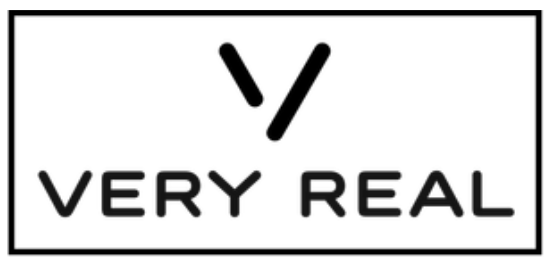

# MOTOR VERYREAL - Proyecto 3



## Autores

- [Cristina Mora Velasco](https://github.com/CristinaMora)
- [Francisco Miguel Galvan Muñoz](https://github.com/CiscoGalvan)
- [Sheila Julvez Lopez](https://github.com/sheilajulvez)
- [Pablo Martínez Quesada ](https://github.com/Ares75643)
- [Alfonso Jaime Rodulfo Guío](https://github.com/ARodulfo)
- [Pablo Cerrada Vega](https://github.com/PabloCerrada)
- [Jose Moreno Barbero](https://github.com/JoseMorenob)
- [Jose E. Robles Roca](https://github.com/josepk01)
- [Agustín Castro De Troya](https://github.com/AgusCDT)
- [Manuel Prada Mínguez](https://github.com/manuelpr07)
<br>

## Guia de estilos
 Nuestra quia de estilos se muestra al completo en el pdf: [Guia_de_Estilos.pdf](Guia_de_Estilo.pdf)


## Compilación del motor

Clona el repositorio

```bash
  git clone https://github.com/UCM-FDI-DISIA/VeryReal.git
```

Abre el directorio correspondiente
```bash
  cd tu ruta de descarga + VeryReal\VeryRealSolucion\dependencias\cMake\
```
Descarga las  dependencias

```bash
 All.bat
```
##  Desarrollo de un videojuego con VeryReal

### Directorio de nuestro videojuego

En este apartado vamos a especificar como debe estar preparado el directorio del videojuego que use VeryReal.En la carpeta raiz vamos a encontrar:
- /bin
- /projects
- /src
- /temp
- /VeryReal
- .gitignore
- .gitmodules
- All.bat
- Nombre_Juego.sln
- updateSubmodule.bat

A continuacion explicaremos el uso de cada elemento:

>/bin: directorio en el que se encuentran los modulos del motor exportados como DLL necesarios para el desarrollo del videojuego a la vez que modulos externos y el ejecutable generado.
  Este directorio se generara automaticamente al ejecutar el All.bat
```bash
En bin necesitaremos dos directorios: Assets y LuaFiles.

En LuaFiles guardaremos nuestros .lua y en Assets los elementos externos a usar.

Tambien deberemos crearnos un resources.cfg donde indicaremos las rutas donde se encontraran nuestros assets.

En el caso de la carpeta de elementos sonoros, esta se llamara "Sonidos"
```
>/projects: aqui encontraremos el .vcxproj a la vez que sus archivos consiguientes.


>/src: carpeta en la que añadiremos todo lo necesario en el desarrollo desde componentes, la propia solucion o el archivo con el que exportamos las clases necesarias.


>/temp: sera el destino de todos nuestros archivos intermedios.


>.gitignore: archivo generado por GitHub que nos ayudara a no subir contenido no deseado (como temp o el propio .vs).


>.gitmodule: archivo generado por GitHub designa VeryReal como un submodulo.


>All.bat: elemento cuya funcion es iniciar el motor por primera vez, descargando las dependencias de nuestro motor y compilandolo, copiando su carpeta bin en nuestro directorio y por ultimo compilando nuestra solucion.
El codigo proporcionado para el All.bat es el siguiente:
```bash
cd VeryReal\VeryRealSolucion\dependencies\cMake
call All.bat
cd VeryReal\VeryRealSolucion
xcopy bin .\..\..\bin\ /s /e

cd ..\..\
msbuild "OvejaVeganaSolucion.sln" /p:configuration=Debug /p:Platform=x64 /p:PlatformToolset=v143
msbuild "OvejaVeganaSolucion.sln" /p:configuration=Release /p:Platform=x64 /p:PlatformToolset=v143
```

>Nuevo_Juego.sln: solucion de Visual Studio.


### Implementacion con VeryReal

A la hora de desarrollar un videojuego con VeryReal hay que tener varias cosas en mente.
La primera es que en el archivo main que se cree debemos exportar una funcion `start` que devuelva `std::pair<bool,std::string>`.
  
Esta funcion `start` debe:
- Devolver como valor la lectura de la primera escena de nuestro juego.
- Inicializar los creators de los componentes que nos hayamos creado.

A esto podriamos sumarle la funcionalidad adicional que deseemos.

Otra cosa a tener en mente es que el bucle de juego esta ya implementado en nuestro motor, por lo que como desarrollador solo tienes que preocuparte de crear componentes y añadirlos a sus entidades en un .lua.


Para usar los Managers pertinentes, haremos su include y los llamaremos de la siguiente manera: `VeryReal::ManagerName::Instance()`.

## Manejo de errores

Para manejar errores hemos optado por una opcion que hace que todas las llamadas propicias a dar errores, como la inicializacion de los Managers o Componentes devuelvan un `std::pair<bool,std::string>`.
La primera parte del pair indicara si se ha producido un error siendo false cuando ocurre y true cuando no.
La segunda parte se trata de un mensaje que, en caso de que hayamos topado con un error, se imprimira a traves de una ventana creada en el momento.

Para poder llegar a metodos de los juegos a los que no tenemos accesos desde el motor (todos excepto start), creamos ErrorManager el cual contiene una variable que nos indicara si ha habido o no error.
Esta variable funciona como una variable de error estatica (sin serla) y sera comprobada en cada bucle y en caso de que haya error saldremos de el y procederemos a terminar con la ejecucion de nuestro juego.


## Estructura del Motor:
Contamos con 1 solución con varios Proyectos en ella. Estos están definidos uno por cada módulo o parte diferenciada en el motor:

<br>

### AudioLeon
Audio leon es el proyecto encargado de la  parte de sonidos. Utiliza como libreria FMOD
<br>


### GuilleElArquitecto

Guille el  arquitecto es el proyecto encargado en definir toda nuestra arquitectura básica. Nuestra Arquitectura se basa en entidades y componentes creados con Factorías o Builders.
A la hora de diseñar nuestra arquitectura tomamos dos decisiones importantes: 
  1. Nuestro módulo GuilleElArquitecto no iba a depender de ningún otro módulo ni ninguna librería
  2. El resto de módulos de nuestro motor dependerían de GuilleElArquitecto
Para realizar este proyecto hemos desarrollado esta serie de clases

### Component:
Esta clase base sirve como modelo a todos los Componentes. Todos estos heredarán de esta clase para seguir con nuestra arquitectura por medio de Entidades y Componentes

#### Creator: 
Es una clase que hace la función de Gestor de Factorías o Builders. Esta hereda de nuestro Singleton y uenta con dos mapas desordenados:
  · Mapa con los diferentes creators component, explicada a continuación esta clase. Este mapa tiene como clave una cadena de caracteres con el nombre del creador del componente y un puntero a este. Está hecho de esta manera para poder llamar a los creadores que necesitamos cuando queremos por medio de la carga de datos.
  · Mapa con las entidades prefabs cargadas mediante Lua. Con clave el nombre de la entidad y argumento puntero a esta.
Esta clase gestiona todos las factorías creadoras del juego y del motor.

#### CreatorComponente:
De esta clase heredarán cada uno de las factorías de los Componentes.
Tiene métodos creados específicamente para recibir datos, crear el componente especificado e inicializarlo
  . Cuenta con un mapa con clave un nombre de un parámetro y argumento una clase creada por nosotros del tipo VariantClass. Esto fue una decisión tomada para solucionar el problema de la diversidad de parámetros que pueden recibir cada Componente

#### CreatorTransformComponent y Transform Component
Hemos decidido hacer este Componente en el motor, ya que casi al 100% todas las entidades que vas a querer crear en un juego van a tener un Transform. De esta manera no estás haciendo cosas del juego en el motor, ya que es algo genérico, que queremos que independientemente del juego que hagas, tengas disponible un Transform aportado por nosotros y no tengas que creartelo tú en tu juego.
Nuestro Transform cuenta con:
  - Vector posicion
  - Vectores de rotación: inicial y actual
  - Vector escala
  - Vector velocidad

#### Entity
Clase base de la Entidad. Cuenta con un mapa desordenado con los Componente y métodos que gestionan este mapa: añadir, borrar, modificar...  Además de una lista de componenntes para remover. Esto está hecho de esta manera para gestionar la eliminación de componentes en tiempo de actualización y no provocar fallos.

#### ErrorInformant y ErrorManager
Estas clases, ambas Singleton, se encargan de la gestión de errores de todo el motor y del juego. Provocan la salida "elegante" del programa por medio de la creación de una ventana emergente. Además hemos gestionado de manera ascendente la detección de errores. De esta forma si falla un componente específico en su creación, inicialización, etc; este error irá escalando capas hasta llegar a la más superficial y generar la ventana de error. Y así con cualquier error posible.

#### Export
En esta archivo de encabezado simplemente tenemos definido los condicionales de definiciones de macros de este módulo. Esto nos sirve para exportar o importar este módulo.

#### Manager
Clase que hereda de Singleton, abstracta, y de la que heredarán cualquier gestor o manager que queramos crearnos.

#### Scene
Clase básica de Escena. Cuenta con la misma metodología que he ido siguiendo. La creación de un mapa desordenado de entidades y una lista para gestionar las eliminaciones de estas. El mapa anterior recogerá todas la entidadas creadas en juego y motor y por medio de la escena las gestionaremos con métodos básicos como añadir, remover, actualizar...

#### SceneManager
Como su nombre indica es una clase que hereda de Manager y trata de gestionar, por medio de una lista, las escenas. Esta hecho de forma que solo se renderice 1 escena, la que encargues de poner como activa. Tiene métodos de gestión de esta lista

#### Singleton
Es nuestra plantilla básica del patrón de diseño que restringe la creación a un único objeto

#### VariantClass
Esta clase cuenta con una variable de tipo variant en la cuál hemos definido los posibles valores que puede recibir un componente en su creadora. Como he nombrado antes en el CreatorComponent

#### Vectores
Hemos definido nuestros propios Vectores de nuestro motor. Estos irán acompañados, en otros módulos, de conversores a otro tipo de vectores que quizás necesitamos en ellos con respecto a ciertas librerías como FMOD en AudioLeon u Ogre en RomeRender.

<br>

### LuaLuengo
LuaLuengo es el módulo encargado de la comunicación entre Lua y nuestro motor. En su script principal, el ScriptManager, se gestionan las siguientes tareas:
        - Lectura de archivos .lua como tabla de entidades, componentes y sus diferentes parámetros. Se hace uso de funciones de LuaBridge para obtener las diferentes tablas.
        - Lectura de archivos .lua específicos para prefabs.
        - Lectura de funciones de Lua.
<br>


### PedroBullet
PedroBullet es el proyecto encargado de la parte de fisicas del motor mediante la libreria de Bullet. Esta compuesto por un un gestor de fisicas y varios componentes.
Clases:

- PhysicsManager: se encarga de llevar a cabo las funciones generales de fisicas. Crear el mundo fisico y actualizarlo. Los metodos principales son los que se encargan de la gestion de colisiones mediante callback, añadir elementos fisicos a la escena y gestionar variables globales como la gravedad.  

- ColliderComponent: componente que se encarga de llamar al callback de colisiones, solo es necesario meterlo si se pretende llamar a alguna funcionalidad al colisionar.

- RigidBodyComponent: componente que contiene un elemento rigidbody de Bullet, un componente ColliderComponent del motor, y todas las variables necesarias para simular un objeto fisico. Tambien contiene la mascara y grupo de la entidad para la comprobación de colisiones usando mascaras de bits.

- PhysicsDebug: objeto que utiliza el PhysicsManager en modo Debug para renderizar los RigidBody.
<br>


### RomeRender
RomeRender es el proyecto encargado de toda la parte de renderizado del motor (3D y 2D), esto lo hace mediante Ogre. Para ello esta formado por una serie de clases que tienen las siguientes
funcionalidades:

- AnimatorComponent: Componente que se encarga del cargado y uso de animaciones, ademas de su gestion.
Para guardar las animaciones se utiliza un unordered_map que nos permite guardarlas, actualizarlas y borrarlas eficazmente.

- CameraComponent: Componente que añade una camara al escenario, a su vez funciona como wrapper de la camara de Ogre. Tiene funcionalidades como: 
  - pitch
  - roll
  - desactivate
  - setviewportbackground

- conversorvectores: puesto que utilizamos nuestros propios vectores, los de Ogre deben quedar ocultos para el resto de proyectos. Para facilitar la tarea de conversiones hemos creado unos metodos dentro del namespace de VeryReal que nos facilitan esa conversion. 
        
- RenderManager: Manager que se encarga de la inicializacion de Ogre a partir de los archivos .cfg, tambien del renderizado de cada frame en su Update y de la carga de
  shaders y recursos. Para finalizar, se encarga de la creacion de nodos para dar al usuario una interfaz desde la que gestionar estos.

- Window: Clase creada para gestionar la funcionalidad de la pantalla, esta es creada con SDL externamente y pasada a Ogre como ventana externa.

- LightComponent: Componente que funciona como wrapper de la luz de Ogre.

- MeshRenderComponent: Componente encargado de crear el .mesh de cada entidad asi como de asignar su material. 

- exportRomeRender: metodo para exportar unicamente el modulo de render.

UI:

- UIButtomComponent: clase base de boton, que detecta cuando el raton esta dentro de su transform y llama a una funcion si se pincha sobre ella. La funcion Action() esta vacia ya que cada boton tiene que   tener una fucionalidad distinta.

- UIProgressBar: clase que nos permite crear una barra de carga por medio de overlay element.

- UISpriteRenderComponent: este componente renderiza imagenes 2D segun el transform que tenga. 

- UITextComponent: permite poder escribir textos en pantalla asi como cargar distintas fuentes de letra.

- UITransformComponent: componente que sirve para indicar la posicion y escala de un objeto. Cogiendo posiciones entre 0 y 1. 
 
<br>

### TonInput <br>

TonInput es el proyecto encargado del input del motor a través de SDL. Para ello se vale de un manager con funciones y variables para manejar los eventos tanto de teclado, ratón como de mando. Clases implicadas:

        - InputManager: manager que se encarga de actualizar los estados del ratón, teclado y mando. En el método Update compruebará si se ha dado algún tipo de evento y lo gestiona en caso de que se haya dado. 

        - TonMapeo: clase que contiene enums para el parseo entre variables de SDL y nuestras propias variables.

A la hora de desarrollar, usaremos el InputManager haciendo su llamada `VeryReal::InputManager::Instance()` para luego utilizar sus metodos.
<br>


